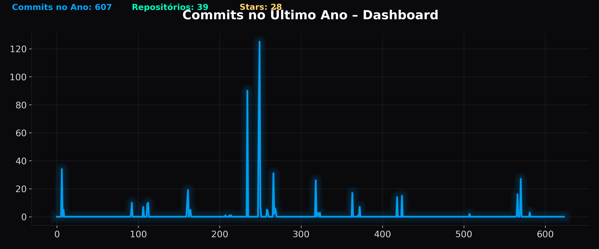

<div align="center">

# GitHub-Stats-Generator  
**Automação Avançada de Estatísticas — Visualização Premium em Tempo Real**

Projeto automatizado que coleta estatísticas da conta GitHub (`Domisnnet`) e gera visualizações profissionais atualizadas diariamente através de GitHub Actions.

---

### Estatísticas mais recentes
A imagem abaixo é atualizada automaticamente todos os dias às 00:00 UTC:



---

</div>

## ✦ O que este projeto faz
Este repositório executa um pipeline completo de coleta e visualização de dados usando a API do GitHub, gerando gráficos com design premium.

O workflow:

1. Consulta todos os repositórios do usuário  
2. Obtém a atividade semanal de commits dos últimos 12 meses  
3. Calcula o total anual  
4. Gera um gráfico moderno em estilo *dashboard-tech*  
5. Salva em `/output/github-stats.png`  
6. Efetua commit automático no próprio repositório  

Tudo sem intervenção humana.

---

## ✦ Destaques Técnicos

- **Python 3.11**  
- **GitHub Actions** executando diariamente  
- **Requests** para acessar a API do GitHub  
- **Matplotlib** com custom theme (gradiente, neon glow, design premium)  
- **Pipeline autônomo**: coleta → processamento → visualização → commit  
- **Arquitetura limpa e modularizada**  
- **Sem dependências externas além do Python**

---

## ✦ Estrutura do Projeto

github-stats-generator/
│
├── generators/
│ └── generate_commits.py # Script principal de geração do gráfico
│
├── utils/
│ ├── github_api.py # Módulo de integração com a API do GitHub
│ └── plot_theme.py # Tema visual premium do gráfico
│
├── output/
│ ├── github-stats.png # Estatística gerada (auto)
│ └── .gitkeep # Mantém a pasta versionada
│
├── requirements.txt
├── README.md
└── .github/
└── workflows/
└── generate_stats.yml # Automação com GitHub Actions

---

## ✦ Como Rodar Localmente

### 1. Clone o repositório
```bash
git clone https://github.com/Domisnnet/github-stats-gnr
cd github-stats-gnr

---

### 2. Instale as dependências
pip install -r requirements.txt

---

### 3. Execute o gerador manualmente
python generators/generate_commits.py

---

### 4.O arquivo será criado em:
output/github-stats.png